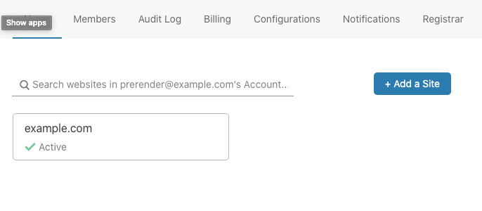
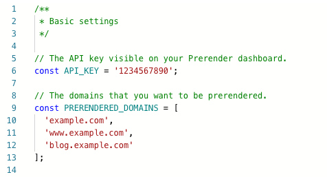
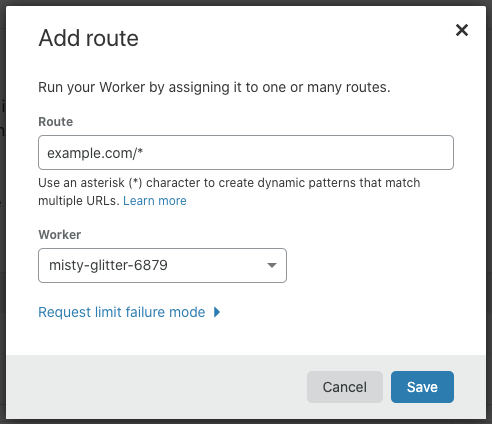

# Prerender Cloudflare worker

This worker sample code lets users who host their website code on static hosting services (such as AWS S3, GitHub Pages...etc) and use Cloudflare for content delivery to use Prerender to prerender their sites for search engines and other bots.

## Installation

The install guide assumes that you already have a site hosted through Cloudflare.

1. Select your site on the Cloudflare dashboard.

2. Navigate through `Workers -> Manage workers -> Create a worker`.

3. Copy and paste the content of index.js over the code editor on the left hand side, overwriting its current content. Please note the name of the worker for later reference(top-left corner).

4. Replace your `API_KEY` value with your actual API key from the Prerender dashboard, and edit the `PRERENDERED_DOMAINS` array to match your site configuration.

> Note: Do not send a test request yet, as the site mapping is not yet done. We'll do that later.

5. Click `Save and Deploy` and navigate back to your workers as explained in step 2, but instead of clicking `Manage workers`, click `Add route`.

6. Edit your route to match your site config (e.g. `example.com/*` to cover your whole site on the Apex domain, or `*.example.com/*` if you want to cover all subdomains too).

7. Click save and you should be good to go!

> Note: Optionally you can now go back to test or debug your worker as shown in step 3, but remember to replace the entire workker URL with your actual site URL (or add your worker URL to the `PRERENDERED_DOMAINS` array).
